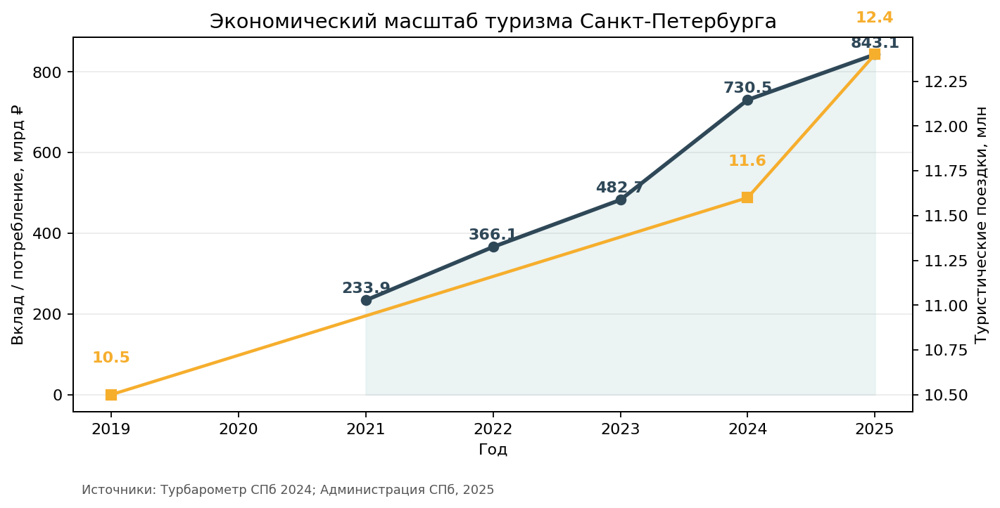
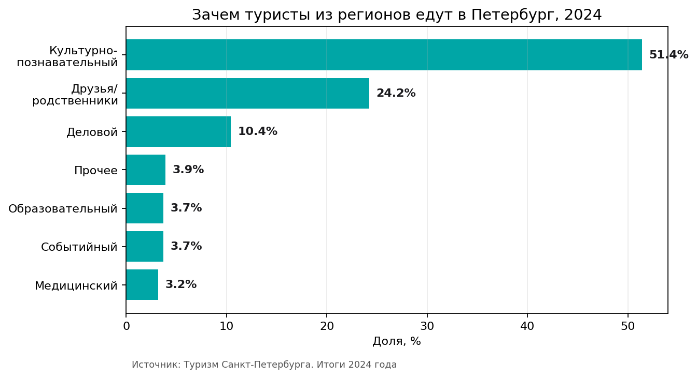
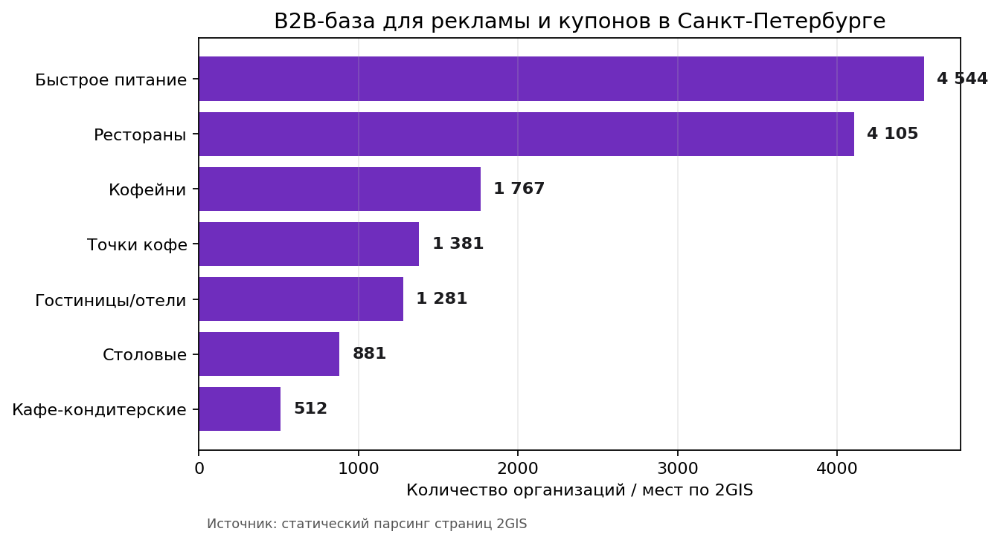
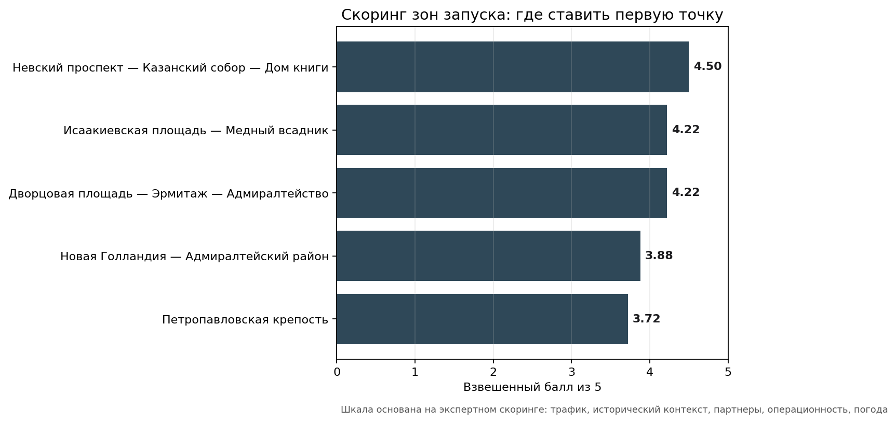
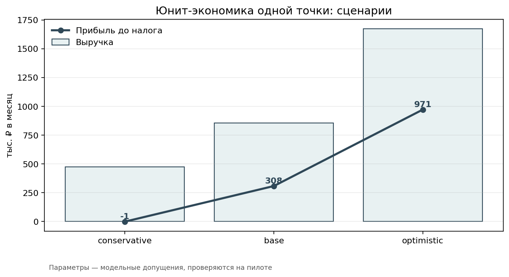
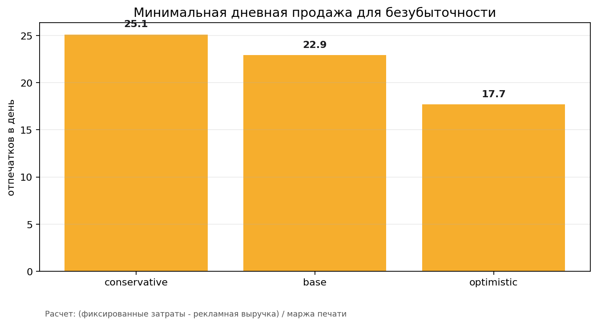

# Save you in history — аналитический отчет

## 1. Суть проекта

Save you in history — туристический продукт на границе сувенира, фотоуслуги и локальной рекламы. Турист делает снимок рядом с исторической достопримечательностью, получает стилизованную печатную открытку «под старую газету / открытку города», а на обороте или в нижнем блоке размещается реклама локального партнера с QR-кодом или купоном.

Продукт решает две задачи:

- для туриста: быстрый физический сувенир с персональным снимком, который не выглядит как обычное фото из фотобудки;
- для локального бизнеса: короткий путь к туристу, который уже находится рядом и готов тратить деньги на еду, размещение, впечатления и подарки.

Модель — B2C + B2B. Турист платит за фото, ресторан/отель/сервис платит за рекламное место и купонную механику. В перспективе модель масштабируется как франшиза для других туристических городов.

## 2. Почему Санкт-Петербург подходит для пилота

Санкт-Петербург подходит как стартовый город для проверки гипотезы по трем причинам.

Во-первых, у города большой туристический поток. По официальному сообщению Администрации Санкт-Петербурга, в 2025 году иногородние и иностранные туристы совершили 12,4 млн поездок в город. Это на 7% больше, чем в 2024 году, когда было 11,6 млн поездок.

Во-вторых, туристический поток экономически значим. В 2025 году вклад туристов в экономику Санкт-Петербурга достиг 843,1 млрд рублей. По данным Турбарометра, в 2024 году туристско-экскурсионное потребление составляло 730,5 млрд рублей, из них 645,4 млрд рублей приходилось на российских туристов и экскурсантов, 85,1 млрд рублей — на иностранных туристов.

В-третьих, продукт совпадает с образом города. Исторический центр Санкт-Петербурга является объектом Всемирного наследия UNESCO. Для продукта, который продает «сохранение себя в истории города», это не декоративная деталь, а часть позиционирования.

Рисунок 1. Динамика туристического вклада подтверждает, что пилот тестируется в городе с крупным платежеспособным туристическим потоком.

## 3. Целевая аудитория

### B2C: туристы

Основной клиент — турист, который уже находится в историческом центре и воспринимает город как культурный опыт. Данные Турбарометра показывают, что в 2024 году культурно-познавательный туризм достиг 51,4% поездок туристов из регионов России, или 5,5 млн поездок. Это хорошо совпадает с продуктом: человек приехал за историей и архитектурой, а продукт превращает его фото в историзированный сувенир.

Второй важный сегмент — семейные туристы. В 2024 году семейные туристы составляли 54,3% внутреннего туристического потока, оценочно 5,8 млн поездок. У семей чаще выше вероятность покупки физического сувенира: открытка может быть подарком, памятью для ребенка или частью семейного архива. Среди семейных туристов культурно-познавательные цели занимают 66,5%.

Третий сегмент — молодые туристы 18–44. Турбарометр описывает портрет российского туриста как молодых активных людей 18–44 лет, часто с высшим или незаконченным высшим образованием. Для этой группы важна визуальность и возможность быстро поделиться результатом в соцсетях, но ценность физического отпечатка отличает продукт от обычного фильтра в телефоне.

Рисунок 2. Культурно-познавательная мотивация является главным аргументом в пользу продукта с исторической стилизацией.

### B2B: локальные рекламодатели

B2B-клиент — бизнес рядом с туристическим маршрутом, которому нужен поток гостей «здесь и сейчас»: рестораны, кофейни, бары, отели, экскурсии, сувенирные лавки, сервисы впечатлений.

Статический парсинг 2GIS показывает существенную партнерскую базу: по запросу ресторанов в Санкт-Петербурге — 4105 мест, по гостиницам/отелям — 1281 место. В рубриках еды 2GIS показывает, например, 1767 кофеен, 4544 организации быстрого питания, 512 кафе-кондитерских и 881 столовую. Это не означает, что все они станут рекламодателями, но показывает емкость для первичной B2B-воронки.

Рисунок 3. Рестораны, кофейни, отели и другие точки питания формируют достаточную базу для первых рекламных продаж.

## 4. География запуска

Для первого запуска сравнивались пять зон исторического центра. Скоринг построен по пяти критериям: туристический трафик, историческое соответствие, плотность потенциальных партнеров, операционная простота и устойчивость к погоде. Это экспертная оценка, а не замер пешеходного трафика.

Итоговый рейтинг:

1. Невский проспект — Казанский собор — Дом книги.
2. Дворцовая площадь — Эрмитаж — Адмиралтейство.
3. Исаакиевская площадь — Медный всадник.
4. Петропавловская крепость.
5. Новая Голландия — Адмиралтейский район.

Рекомендация: начинать с зоны Невского проспекта. Причина — лучший баланс туристического потока, понятной навигации, большого количества ресторанов и кофеен, а также более простой операционной модели по сравнению с Дворцовой площадью, где сильнее исторический эффект, но сложнее согласования и размещение оборудования.

Рисунок 4. Невский проспект получает лучший суммарный балл за счет баланса трафика, B2B-плотности и операционной простоты.

## 5. Концепция продукта

Формат одного заказа:

1. Турист подходит к точке / мобильному промоутеру.
2. Оператор делает фото или турист загружает фото через QR.
3. Система накладывает один из 3–5 шаблонов: «историческая газета», «дореволюционная открытка», «ретро-афиша», «музейная карточка».
4. Фото печатается на плотной бумаге.
5. На обороте или в нижней зоне печати — QR-код партнера: ресторан, отель, экскурсия, сувенирный магазин.
6. Турист получает физический сувенир и цифровую копию.

Минимальный набор шаблонов для пилота:

- «Северная столица, 1913» — дореволюционная открытка;
- «Ленинградская хроника» — стилизация под старую газету;
- «Петербургский вестник» — городской газетный макет;
- «Музейная карточка» — аккуратный премиальный формат для Эрмитажа/Исаакия;
- «Белые ночи» — сезонный шаблон.

## 6. Юнит-экономика

Все финансовые параметры ниже — модельные допущения для пилота. Их нужно проверять фактическими продажами на первой точке.

Базовый сценарий одной точки:

- цена отпечатка: 590 рублей;
- средние продажи: 45 отпечатков в день;
- переменная себестоимость: 125 рублей на отпечаток;
- фиксированные расходы точки: 380 000 рублей в месяц;
- рекламные партнеры: 5 партнеров по 12 000 рублей в месяц;
- CAPEX точки: 520 000 рублей.

При этих параметрах месячная выручка от печати составляет 796 500 рублей, рекламная выручка — 60 000 рублей, переменные затраты — 168 750 рублей. Прибыль до налога — около 307 750 рублей в месяц. Точка безубыточна примерно от 23 отпечатков в день.

Рисунок 5. Базовый сценарий показывает положительную операционную прибыль при 45 отпечатках в день и 5 рекламных партнерах.

Консервативный сценарий при 25 отпечатках в день почти выходит в ноль, но при заданных допущениях остается немного отрицательным: около -1,3 тыс. рублей в месяц. Оптимистичный сценарий при 75 отпечатках в день и цене 690 рублей дает пространство для франшизной модели, но его нельзя закладывать как базу до пилотного замера.

Рисунок 6. Минимальный ориентир пилота — стабильно держаться выше порога безубыточности по дневным продажам.

## 7. Маркетинговая кампания

Кампания строится вокруг простой связки: туристический сувенир + локальный купон.

Пилот на 6 недель:

- QR-купон внизу открытки: цель — измерить, используют ли туристы предложение партнера;
- карточка точки в 2GIS и Яндекс Картах: цель — собрать отзывы и поисковый спрос;
- стойки отелей и туристские инфоцентры: цель — привести семейных туристов;
- короткая UGC-механика в VK/Telegram: цель — получить органические отметки и фотографии продукта;
- B2B-пакет для ресторанов/отелей: цель — 5 платящих партнеров на первую точку.

Показатели пилота:

- 1200+ отпечатков в месяц;
- 5 рекламных партнеров;
- QR-конверсия 8–12%;
- рейтинг точки 4,7+ после 30 отзывов;
- подтверждение безубыточности при 25–30 отпечатках в день.

## 8. Риски

| Риск | Что может пойти не так | Снижение риска |
|---|---|---|
| Согласования в историческом центре | Нельзя поставить стационарную точку в желаемом месте | начинать с мобильной стойки / партнерской площадки / отеля |
| Погодный фактор | Дождь и холод снижают уличный поток | тестировать точки рядом с крытыми переходами и кафе |
| Слабый B2B-интерес | Рестораны не готовы платить до доказанной конверсии | первая неделя по CPA/купонной модели, затем фиксированный пакет |
| Очередь и медленная печать | Турист не готов ждать | ограничить шаблоны, печать до 2–3 минут, выдача цифровой копии |
| Слишком «дешевый» визуальный результат | Продукт воспринимается как обычный фильтр | делать макеты как сувенирную полиграфию, а не как обработку фото |

## 9. Что делать дальше

1. Согласовать один пилотный маршрут и 2–3 конкретные точки размещения.
2. Подготовить 5 шаблонов под Санкт-Петербург и протестировать восприятие на 20–30 туристах.
3. Подписать 5 локальных рекламодателей на пилотный пакет.
4. Провести 6-недельный пилот и собрать фактические метрики: продажи, средний чек, QR-переходы, конверсии партнеров, отзывы, время обслуживания.
5. После пилота обновить модель и решить, масштабировать ли проект до 3 точек в Санкт-Петербурге.

## 10. Вывод

Гипотеза выглядит жизнеспособной для пилота в Санкт-Петербурге. Спрос поддерживается большим туристическим потоком и культурно-познавательным профилем поездок. B2B-часть имеет достаточную базу за счет плотности ресторанов, кофеен и отелей. Наиболее рациональная первая зона — Невский проспект — Казанский собор — Дом книги. Ключевая проверка пилота — фактическое число отпечатков в день и QR-конверсия рекламных купонов.
